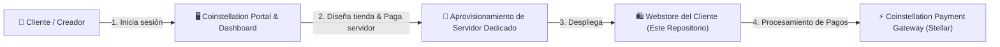
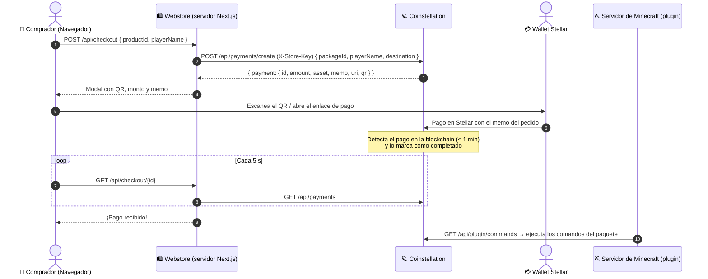

# 🪐 Coinstellation Webstore — Tienda de Ejemplo & Arquitectura de Referencia

[](https://nextjs.org/)
[](https://react.dev/)
[](https://tailwindcss.com/)
[](https://stellar.org/)
[](https://www.typescriptlang.org/)

Este repositorio es una **tienda web de demostración (Webstore)** construida para **Coinstellation**, una plataforma que permite a creadores y comunidades diseñar su propia página web de ventas y monetizar mediante la red blockchain **Stellar (XLM)** a través de una infraestructura de servidores dedicados gestionados desde el panel central.

---

## 📖 Índice

- [1. Visión General del Ecosistema Coinstellation](#1-visión-general-del-ecosistema-coinstellation)
- [2. Arquitectura del Repositorio](#2-arquitectura-del-repositorio)
- [3. Flujo Integral de Compra y Pagos (Stellar)](#3-flujo-integral-de-compra-y-pagos-stellar)
- [4. API de Coinstellation que usa la tienda](#4-api-de-coinstellation-que-usa-la-tienda)
- [5. Configuración](#5-configuración)
- [6. Puesta en Marcha Local](#6-puesta-en-marcha-local)
- [7. Guía Rápida para Modelos de IA (AI Context Guide)](#7-guía-rápida-para-modelos-de-ia-ai-context-guide)

---

## 1. Visión General del Ecosistema Coinstellation

El modelo de negocio y técnico de Coinstellation opera en tres fases:



1. **Dashboard & Creación de Proyecto**:
   - El creador accede al portal principal con su cuenta.
   - Diseña visualmente su tienda (logos, productos, rangos, precios en USD/XLM).
   - Contrata y paga el servidor en la nube donde se alojará su tienda web.
2. **Servidor y Webstore Dedicada**:
   - Se aprovisiona una instancia basada en este repositorio con la configuración, branding y productos del cliente.
3. **Gestión de Ventas y Pagos**:
   - Cada tienda web se comunica de forma autenticada con el backend de Coinstellation usando una clave única de tienda (`X-Store-Key`).
   - Los clientes finales pagan con XLM o USDC escaneando un código QR o abriendo su billetera Stellar (ej. Freighter o Lobstr) con un `memo` identificador de orden.

---

## 2. Arquitectura del Repositorio

El proyecto utiliza **Next.js 16 (App Router)** con Server Components y Client Components, Tailwind CSS v4 y TypeScript:

```
coinstellation-webstore-example/
├── 📁 app/                             # Next.js App Router
│   ├── 📁 api/
│   │   └── 📁 payments/
│   │       └── 📁 create/
│   │           └── route.ts            # Proxy seguro del backend hacia Coinstellation
│   ├── globals.css                     # Estilos globales y tokens de diseño
│   ├── layout.tsx                      # Layout raíz y fuentes del sitio
│   └── page.tsx                        # Página principal (catálogo, carrito, checkout)
├── 📁 components/                      # Componentes reutilizables
│   ├── 📁 sidebar/
│   │   ├── cart.tsx                    # Carrito lateral interactivo con botón checkout
│   │   ├── donor-card.tsx              # Tarjeta de donador del mes
│   │   ├── navigation-menu.tsx         # Menú de navegación por categorías
│   │   └── recent-purchases.tsx        # Widget de compras recientes en tiempo real
│   ├── about-section.tsx               # Sección informativa del servidor / comunidad
│   ├── footer.tsx                      # Pie de página y créditos
│   ├── header-banner.tsx               # Banner Hero con IP del servidor y Discord
│   ├── payment-modal.tsx               # Modal de pago Stellar (QR, Memo, URI, copiar)
│   ├── product-item.tsx                # Tarjeta individual de producto
│   ├── product-modal.tsx               # Modal de detalles de producto
│   ├── product-section.tsx             # Grilla de productos por categoría
│   └── topbar.tsx                      # Barra superior (moneda, autenticación)
├── 📁 app/api/checkout/                # 🔒 Rutas del SERVIDOR de la tienda (usan la API key)
│   ├── route.ts                        # POST: crea el cobro del paquete en Coinstellation
│   └── [paymentId]/route.ts            # GET: estado del pago (lo consulta el modal)
├── 📁 data/
│   ├── mock-data.ts                    # Catálogo de la tienda (nombres, precios de vitrina, íconos)
│   └── coinstellation-packages.ts      # 📍 ID del paquete de Coinstellation de cada producto
├── 📁 lib/
│   ├── coinstellation-server.ts        # 🔒 Cliente de la API de Coinstellation (solo servidor)
│   ├── checkout-client.ts              # Navegador → rutas /api/checkout de la tienda
│   ├── copy-text.ts                    # Copiar al portapapeles (también por HTTP)
│   └── player-name.ts                  # Validación del nombre de jugador
├── 📁 types/
│   └── webstore.ts                     # Definiciones TypeScript de productos, carrito y pagos
├── .env.example                        # 📍 Plantilla de variables de entorno
├── .env.local                          # Tus variables (no se sube a git)
└── package.json                        # Dependencias y scripts
```

### Componentes Clave

| Componente / Archivo | Tipo | Responsabilidad Principal |
| :--- | :--- | :--- |
| `app/page.tsx` | Client Component | Estado del carrito y del jugador; inicia el checkout (un ítem por pago). |
| `components/payment-modal.tsx` | Client Component | QR, enlace `web+stellar:pay`, memo obligatorio y **consulta del estado** hasta que el pago se confirma. |
| `app/api/checkout/*` | Route Handlers | Llaman a Coinstellation **desde el servidor** con la API key de `.env.local`. |
| `data/coinstellation-packages.ts` | Config | Vincula cada producto de la tienda con un paquete creado en el panel. |

---

## 3. Flujo Integral de Compra y Pagos (Stellar)

La API key de Coinstellation **nunca llega al navegador**: el navegador habla con las rutas `/api/checkout` de la propia tienda, y esas rutas llaman a Coinstellation.



---

## 4. API de Coinstellation que usa la tienda

Todas las llamadas llevan el header `X-Store-Key: <tu API key>` y se hacen desde el servidor.

### `POST /api/payments/create`

```json
{
  "packageId": "ID del paquete en Coinstellation",
  "playerName": "Steve",
  "destination": "G… (tu wallet pública)",
  "reference": "rank-vip:Steve"
}
```

- El **monto y el activo** (XLM o USDC) los define el paquete en Coinstellation; no se envían.
- `playerName`: letras, números, `_` y `.` (máx. 32). Reemplaza `%p%` en los comandos del paquete.
- Respuesta `201`: `{ payment: { id, amount, asset, destination, memo, uri, qr } }` (`asset` es `"native"` para XLM).
- Errores: `401` API key inválida · `404` paquete inexistente · `422` datos inválidos · `502/503` Cosmos no disponible.

### `GET /api/payments?count=200`

Lista los pagos de la cuenta. La tienda busca el suyo por `cosmosIntentId === payment.id` y lee `status`: `pending`, `processing`, `completed`, `failed`, `cancelled` o `expired`.

---

## 5. Configuración

### Variables de entorno (`.env.local`)

Copia `.env.example` a `.env.local` y completa:

```env
# URL del servidor de Coinstellation (Dashboard → API → "Endpoint Base")
COINSTELLATION_API_URL=http://129.151.100.83:25571

# API key de tu cuenta (Dashboard → API → "Generar API key")
COINSTELLATION_API_KEY=cs_live_...

# Tu wallet pública de Stellar (Dashboard → Billetera)
COINSTELLATION_WALLET=G...
```

> [!WARNING]
> No renombres estas variables a `NEXT_PUBLIC_*`: la API key quedaría expuesta en el navegador.

### Vincular productos con paquetes (`data/coinstellation-packages.ts`)

1. Crea el paquete en el panel (Dashboard → Paquetes), con su precio, activo y comandos.
2. Copia su ID (Dashboard → API → elige el paquete en "Simular pago" y copia el `packageId`).
3. Pégalo en la línea del producto correspondiente:
   ```ts
   "rank-vip": "a1b2c3d4-…",
   ```

Un producto sin ID no se puede comprar: la tienda lo avisa al intentar pagarlo.

---

## 6. Puesta en Marcha Local

1. **Instalar dependencias**:
   ```bash
   npm install
   ```
2. **Configurar** `.env.local` y `data/coinstellation-packages.ts` (sección 5).
3. **Ejecutar la tienda**:
   ```bash
   npm run dev
   ```
   Disponible en [http://localhost:3001](http://localhost:3001).
4. **Probar una compra**:
   - Configura tu nombre de jugador (arriba a la derecha) y agrega un producto vinculado al carrito.
   - Pulsa **"Pagar con Tarjeta o Web3"**: se abre el modal con el QR, el monto y el memo.
   - Paga desde una wallet Stellar (en testnet si tu API key es `dv_`). El modal pasa solo a **"¡Pago recibido!"** cuando Coinstellation confirma el pago.
   - El pago aparece como `Completado` en el Historial de pagos del panel, y los comandos del paquete quedan en la cola del plugin del servidor.

---

## 7. Guía Rápida para Modelos de IA (AI Context Guide)

- **Propósito**: tienda de ejemplo integrada con Coinstellation (pagos en Stellar + entrega de comandos en Minecraft).
- **Seguridad**: la API key solo se usa en `lib/coinstellation-server.ts` (route handlers). Nunca importarlo desde componentes cliente ni exponer variables `NEXT_PUBLIC_*` con credenciales.
- **Checkout**: `app/page.tsx` → `lib/checkout-client.ts` → `app/api/checkout` → Coinstellation. Un pago por ítem del carrito.
- **Confirmación**: nunca simular ni inventar hashes de transacción; el estado real se lee con `GET /api/checkout/{id}`.
- **Estilos**: Tailwind CSS v4 con variables CSS personalizadas en [app/globals.css](file:///app/globals.css).

---

Hecho con ⚡ para el ecosistema **Coinstellation**.
