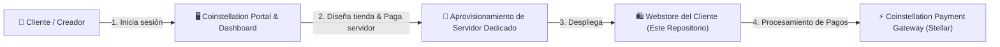
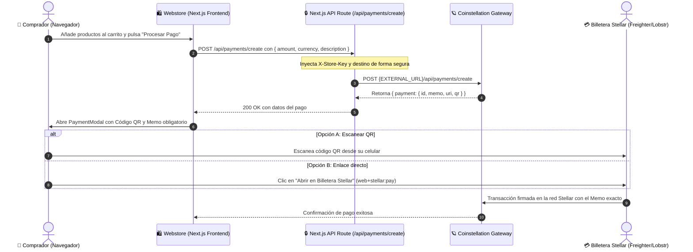

# 🪐 Coinstellation Webstore — Tienda de Ejemplo & Arquitectura de Referencia

[](https://nextjs.org/)
[](https://react.dev/)
[](https://tailwindcss.com/)
[](https://stellar.org/)
[](https://www.typescriptlang.org/)

Este repositorio es una **tienda web de demostración (Webstore)** construida para **Coinstellation**, una plataforma que permite a creadores y comunidades diseñar su propia página web de ventas y monetizar mediante la red blockchain **Stellar (XLM)** a través de una infraestructura de servidores dedicados gestionados desde el panel central.

---

## 📖 Índice

- [1. Visión General del Ecosistema Coinstellation](#1-visión-general-del-ecosistema-coinstellation)
- [2. Arquitectura del Repositorio](#2-arquitectura-del-repositorio)
- [3. Flujo Integral de Compra y Pagos (Stellar)](#3-flujo-integral-de-compra-y-pagos-stellar)
- [4. Especificación Técnica de la API](#4-especificación-técnica-de-la-api)
- [5. Configuración y Variables de Entorno](#5-configuración-y-variables-de-entorno)
- [6. Puesta en Marcha Local](#6-puesta-en-marcha-local)
- [7. Guía Rápida para Modelos de IA (AI Context Guide)](#7-guía-rápida-para-modelos-de-ia-ai-context-guide)

---

## 1. Visión General del Ecosistema Coinstellation

El modelo de negocio y técnico de Coinstellation opera en tres fases:



1. **Dashboard & Creación de Proyecto**:
   - El creador accede al portal principal con su cuenta.
   - Diseña visualmente su tienda (logos, productos, rangos, precios en USD/XLM).
   - Contrata y paga el servidor en la nube donde se alojará su tienda web.
2. **Servidor y Webstore Dedicada**:
   - Se aprovisiona una instancia basada en este repositorio con la configuración, branding y productos del cliente.
3. **Gestión de Ventas y Pagos**:
   - Cada tienda web se comunica de forma autenticada con el backend de Coinstellation usando una clave única de tienda (`X-Store-Key`).
   - Los clientes finales pagan con XLM escaneando un código QR o abriendo su billetera Stellar (ej. Freighter o Lobstr) con un `memo` identificador de orden.

---

## 2. Arquitectura del Repositorio

El proyecto utiliza **Next.js 16 (App Router)** con Server Components y Client Components, Tailwind CSS v4 y TypeScript:

```
coinstellation-webstore-example/
├── 📁 app/                             # Next.js App Router
│   ├── 📁 api/
│   │   └── 📁 payments/
│   │       └── 📁 create/
│   │           └── route.ts            # Proxy seguro del backend hacia Coinstellation
│   ├── globals.css                     # Estilos globales y tokens de diseño
│   ├── layout.tsx                      # Layout raíz y fuentes del sitio
│   └── page.tsx                        # Página principal (catálogo, carrito, checkout)
├── 📁 components/                      # Componentes reutilizables
│   ├── 📁 sidebar/
│   │   ├── cart.tsx                    # Carrito lateral interactivo con botón checkout
│   │   ├── donor-card.tsx              # Tarjeta de donador del mes
│   │   ├── navigation-menu.tsx         # Menú de navegación por categorías
│   │   └── recent-purchases.tsx        # Widget de compras recientes en tiempo real
│   ├── about-section.tsx               # Sección informativa del servidor / comunidad
│   ├── footer.tsx                      # Pie de página y créditos
│   ├── header-banner.tsx               # Banner Hero con IP del servidor y Discord
│   ├── payment-modal.tsx               # Modal de pago Stellar (QR, Memo, URI, copiar)
│   ├── product-item.tsx                # Tarjeta individual de producto
│   ├── product-modal.tsx               # Modal de detalles de producto
│   ├── product-section.tsx             # Grilla de productos por categoría
│   └── topbar.tsx                      # Barra superior (moneda, autenticación)
├── 📁 data/
│   └── mock-data.ts                    # Catálogo demo (rangos permanentes y temporales)
├── 📁 lib/
│   ├── payment-config.ts               # 📍 CONFIGURACIÓN: URL externa, Store Key y Wallet
│   └── payment-service.ts              # Cliente para invocar la API de pagos
├── 📁 types/
│   └── webstore.ts                     # Definiciones TypeScript de productos, carrito y pagos
├── .env.example                        # Plantilla de variables de entorno
├── .env.local                          # Variables locales (no commiteado)
└── package.json                        # Dependencias y scripts
```

### Componentes Clave

| Componente / Archivo | Tipo | Responsabilidad Principal |
| :--- | :--- | :--- |
| `app/page.tsx` | Client Component | Orquestador principal: estado del carrito, modal de producto y modal de pago. |
| `components/sidebar/cart.tsx` | Client Component | Muestra los ítems agregados, cálculo del total y dispara el evento de checkout. |
| `components/payment-modal.tsx` | Client Component | Renderiza el QR de pago Stellar, campo de **Memo obligatorio** y enlace `web+stellar:pay`. |
| `app/api/payments/create/route.ts` | Server Route Handler | Proxy seguro que inyecta la `X-Store-Key` y reenvía el cobro al servidor externo. |
| `lib/payment-config.ts` | Config Module | Centraliza la URL externa de Coinstellation, la wallet del creador y las credenciales. |

---

## 3. Flujo Integral de Compra y Pagos (Stellar)

El siguiente diagrama detalla cómo interactúan el cliente, la tienda web y la API de Coinstellation:



---

## 4. Especificación Técnica de la API

### Petición Externa (`POST /api/payments/create`)

El servidor externo de Coinstellation espera la siguiente estructura:

#### Headers Requeridos
```http
Content-Type: application/json
X-Store-Key: tu_clave_de_webstore
```

#### Body (JSON)
```json
{
  "destination": "GBBD47IF6LWK7P7MDEVSCWR7DPUWV3NY3DTQEVFL4NAT4AQH3ZLLFLA5",
  "amount": "24.99",
  "currency": "XLM",
  "description": "Orden #1001"
}
```

| Campo | Tipo | Requerido | Descripción |
| :--- | :--- | :---: | :--- |
| `destination` | `string` | Sí | Clave pública (G...) de la billetera Stellar donde el creador recibe los fondos. |
| `amount` | `string` | Sí | Monto a cobrar con formato decimal (ej: `"24.99"`). |
| `currency` | `string` | Sí | Criptomoneda de cobro (por defecto `"XLM"`). |
| `description` | `string` | Opcional | Etiqueta o identificador de orden visible para el comprador. |

#### Respuesta Exitosa (200 OK)
```json
{
  "payment": {
    "id": "pay_987654321",
    "memo": "1727182345123",
    "uri": "web+stellar:pay?destination=GBBD...&amount=24.99&asset_code=XLM&memo=1727182345123&memo_type=MEMO_TEXT",
    "qr": "data:image/png;base64,iVBORw0KGgo..."
  }
}
```

| Campo | Tipo | Utilidad en la UI |
| :--- | :--- | :--- |
| `payment.id` | `string` | Identificador único de la transacción en el sistema Coinstellation. |
| `payment.memo` | `string` | **Memo obligatorio** en Stellar para asociar la transferencia al pedido. |
| `payment.uri` | `string` | Enlace compatible con el protocolo `web+stellar:pay` para billeteras. |
| `payment.qr` | `string` | Imagen del código QR (soporta Base64, data-URI, URL o SVG). |

---

## 5. Configuración y Variables de Entorno

### Dónde colocar la URL de tu API externa

Tienes dos opciones según tu flujo de trabajo:

#### Opción 1: Archivo `.env.local` (Recomendado)
Copia [.env.example](file:///.env.example) a `.env.local`:
```env
# URL base de tu backend / servidor de pagos de Coinstellation
COINSTELLATION_API_URL=https://api.tu-servicio-coinstellation.com

# Clave de autenticación de tu tienda (para el header X-Store-Key)
COINSTELLATION_STORE_KEY=tu_clave_secreta_de_tienda

# Wallet Stellar (G...) del creador que recibirá los pagos
COINSTELLATION_DESTINATION_WALLET=GBBD47IF6LWK7P7MDEVSCWR7DPUWV3NY3DTQEVFL4NAT4AQH3ZLLFLA5

# (Opcional) Activar modo simulación para pruebas en local sin backend
COINSTELLATION_ENABLE_MOCK=false
```

#### Opción 2: Archivo [lib/payment-config.ts](file:///lib/payment-config.ts)
Si prefieres definir las constantes directamente en código TypeScript:
```typescript
export const EXTERNAL_PAYMENTS_API_URL = "https://api.tu-servicio-coinstellation.com";
export const STORE_KEY = "tu_clave_secreta_de_tienda";
export const DEFAULT_DESTINATION_WALLET = "GBBD47IF6LWK7P7MDEVSCWR7DPUWV3NY3DTQEVFL4NAT4AQH3ZLLFLA5";
```

> [!TIP]
> Si aún no has desplegado tu servidor de pagos externo, puedes activar `ENABLE_MOCK_PAYMENT = true` en [lib/payment-config.ts](file:///lib/payment-config.ts) para probar todo el flujo visual y el modal de pago inmediatamente en tu máquina.

---

## 6. Puesta en Marcha Local

### Requisitos previos
- Node.js 18.18+ o superior
- npm, yarn o pnpm

### Pasos de instalación

1. **Instalar dependencias**:
   ```bash
   npm install
   ```

2. **Configurar el entorno**:
   ```bash
   cp .env.example .env.local
   ```
   *(Modifica `.env.local` con tu URL y Store Key)*

3. **Conexión con el Sistema Principal (coinstellation-frontend)**:
   - Asegúrate de que `coinstellation-frontend` esté corriendo en el puerto 3000 (`http://localhost:3000`).
   - En tu archivo `.env.local`:
     ```env
     COINSTELLATION_API_URL=http://localhost:3000
     COINSTELLATION_STORE_KEY=tu_clave_de_webstore
     COINSTELLATION_DESTINATION_WALLET=GBBD47IF6LWK7P7MDEVSCWR7DPUWV3NY3DTQEVFL4NAT4AQH3ZLLFLA5
     ```

4. **Ejecutar la Webstore en desarrollo**:
   ```bash
   npm run dev
   ```
   La tienda web estará disponible en [http://localhost:3001](http://localhost:3001).

5. **Flujo de Prueba de Venta en Vivo**:
   - Agrega cualquier producto al carrito (ej. Rango Titan) y presiona **"Procesar Pago"**.
   - Se abrirá el modal con el código QR, Memo y monto en XLM generado directamente por Coinstellation.
   - Presiona **"Confirmar Pago (Efectuar Venta)"** para simular la confirmación on-chain con un txHash.
   - Haz clic en **"Ver Venta en el Dashboard"** (o ve a [http://localhost:3000/dashboard](http://localhost:3000/dashboard)).
   - Verás la venta reflejada inmediatamente en los **Ingresos Netos**, **Pedidos Totales**, **Gráficos** y en el **Historial de Pagos** como `Completado`.

---

## 7. Guía Rápida para Modelos de IA (AI Context Guide)

Para cualquier agente o LLM que trabaje sobre este repositorio, estas son las reglas y contratos clave:

- **Propósito**: Webstore plantilla para clientes de Coinstellation conectada a un servidor de pagos pagado por el cliente en el Dashboard.
- **Entrypoint UI**: [app/page.tsx](file:///app/page.tsx) gestiona el estado principal (`cartItems`, `paymentDetails`, `isPaymentModalOpen`).
- **Punto de integración con backend**: [app/api/payments/create/route.ts](file:///app/api/payments/create/route.ts) actúa como proxy server-to-server hacia `${EXTERNAL_PAYMENTS_API_URL}/api/payments/create`.
- **Credenciales & Headers**: Toda llamada saliente al servicio de pagos debe incluir el header `X-Store-Key: <STORE_KEY>`.
- **Estructura de respuesta**: Toda respuesta válida contiene `{ payment: { id, memo, uri, qr } }`. Si la API externa falla, la ruta proxy retorna `{ error: string, message: string }` con código HTTP apropiado.
- **Estilos**: Tailwind CSS v4 con variables CSS personalizadas en [app/globals.css](file:///app/globals.css) (`--bg-dark: #170d2b`, `--bg-card: #1c1e22`, `--primary-color: #2b7fff`, `--accent-green: #2ecc71`).

---

Hecho con ⚡ para el ecosistema **Coinstellation**.
