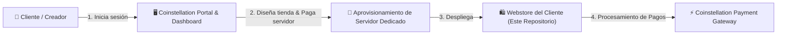
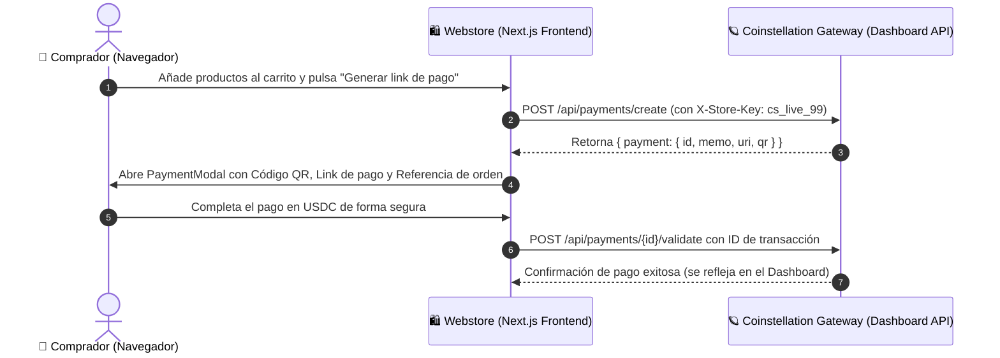

# 🪐 Coinstellation Webstore — Tienda de Ejemplo & Arquitectura de Referencia

[](https://nextjs.org/)
[](https://react.dev/)
[](https://tailwindcss.com/)
[](https://www.typescriptlang.org/)

Este repositorio es una **tienda web de demostración (Webstore)** construida para **Coinstellation**, una plataforma que permite a creadores y comunidades diseñar su propia página web de ventas y monetizar en **USDC** con links de pago seguros y entrega automática a través de servidores dedicados gestionados desde el panel central.

---

## 📖 Índice

- [1. Visión General del Ecosistema Coinstellation](#1-visión-general-del-ecosistema-coinstellation)
- [2. Arquitectura del Repositorio](#2-arquitectura-del-repositorio)
- [3. Flujo Integral de Compra y Pagos](#3-flujo-integral-de-compra-y-pagos)
- [4. Especificación Técnica de la API](#4-especificación-técnica-de-la-api)
- [5. Configuración y Variables de Entorno](#5-configuración-y-variables-de-entorno)
- [6. Puesta en Marcha Local](#6-puesta-en-marcha-local)
- [7. Guía Rápida para Modelos de IA (AI Context Guide)](#7-guía-rápida-para-modelos-de-ia-ai-context-guide)

---

## 1. Visión General del Ecosistema Coinstellation

El modelo de negocio y técnico de Coinstellation opera en tres fases:



1. **Dashboard & Creación de Proyecto**:
   - El creador accede al portal principal con su cuenta.
   - Diseña visualmente su tienda (logos, productos, rangos, precios en USDC).
   - Contrata y paga el servidor en la nube donde se alojará su tienda web.
2. **Servidor y Webstore Dedicada**:
   - Se aprovisiona una instancia basada en este repositorio con la configuración, branding y productos del cliente.
3. **Gestión de Ventas y Pagos**:
   - Cada tienda web se comunica de forma autenticada con el backend de Coinstellation usando una clave única de tienda (`X-Store-Key`).
   - Los clientes finales generan un link de pago seguro en USDC con procesamiento y entrega inmediata.

---

## 2. Arquitectura del Repositorio

El proyecto utiliza **Next.js 16 (App Router)** con Server Components y Client Components, Tailwind CSS v4 y TypeScript:

```
coinstellation-webstore-example/
├── 📁 app/                             # Next.js App Router
│   ├── 📁 api/
│   │   └── 📁 payments/
│   │       └── 📁 create/
│   │           └── route.ts            # Proxy seguro del backend hacia Coinstellation
│   ├── globals.css                     # Estilos globales y tokens de diseño
│   ├── layout.tsx                      # Layout raíz y fuentes del sitio
│   └── page.tsx                        # Página principal (catálogo, carrito, checkout)
├── 📁 components/                      # Componentes reutilizables
│   ├── 📁 sidebar/
│   │   ├── cart.tsx                    # Carrito lateral interactivo con botón "Generar link de pago"
│   │   ├── donor-card.tsx              # Tarjeta de donador del mes
│   │   ├── navigation-menu.tsx         # Menú de navegación por categorías
│   │   └── recent-purchases.tsx        # Widget de compras recientes en tiempo real
│   ├── about-section.tsx               # Sección informativa del servidor / comunidad
│   ├── footer.tsx                      # Pie de página y créditos
│   ├── header-banner.tsx               # Banner Hero con IP del servidor y Discord
│   ├── payment-modal.tsx               # Modal de pago seguro en USDC (QR, Referencia, Enlace)
│   ├── product-item.tsx                # Tarjeta individual de producto
│   ├── product-modal.tsx               # Modal de detalles de producto
│   ├── product-section.tsx             # Grilla de productos por categoría
│   └── topbar.tsx                      # Barra superior (moneda USDC, autenticación)
├── 📁 data/
│   └── mock-data.ts                    # Catálogo demo (rangos y productos en USDC)
├── 📁 lib/
│   ├── payment-config.ts               # 📍 CONFIGURACIÓN: URL externa, Store Key
│   └── payment-service.ts              # Cliente para invocar la API de pagos
├── 📁 types/
│   └── webstore.ts                     # Definiciones TypeScript de productos, carrito y pagos
├── .env.example                        # Plantilla de variables de entorno
├── .env.local                          # Variables locales (no commiteado)
└── package.json                        # Dependencias y scripts
```

### Componentes Clave

| Componente / Archivo | Tipo | Responsabilidad Principal |
| :--- | :--- | :--- |
| `app/page.tsx` | Client Component | Orquestador principal: estado del carrito, modal de producto y modal de pago. |
| `components/sidebar/cart.tsx` | Client Component | Muestra los ítems agregados, cálculo del total y botón "Generar link de pago". |
| `components/payment-modal.tsx` | Client Component | Renderiza el modal de pago seguro en USDC, referencia de orden y confirmación. |
| `lib/payment-service.ts` | SDK Service | Cliente directo de Coinstellation (`Coinstellation`) con `checkout.process` y `checkout.validate`. |
| `lib/payment-config.ts` | Config Module | Centraliza las credenciales de la Sección API del Dashboard (`cs_live_99` y URL base). |

---

## 3. Flujo Integral de Compra y Pagos

La tienda web se conecta directamente con la API de Coinstellation según las especificaciones de la **Sección API del Dashboard**:



---

## 4. Especificación Técnica de la API

### Petición Externa (`POST /api/payments/create`)

El servidor externo de Coinstellation espera la siguiente estructura:

#### Headers Requeridos
```http
Content-Type: application/json
X-Store-Key: tu_clave_de_webstore
```

#### Body (JSON)
```json
{
  "destination": "GBBD47IF6LWK7P7MDEVSCWR7DPUWV3NY3DTQEVFL4NAT4AQH3ZLLFLA5",
  "amount": "24.99",
  "currency": "USDC",
  "description": "Orden #1001"
}
```

| Campo | Tipo | Requerido | Descripción |
| :--- | :--- | :---: | :--- |
| `destination` | `string` | Sí | Identificador / cuenta destino de recepción. |
| `amount` | `string` | Sí | Monto a cobrar con formato decimal (ej: `"24.99"`). |
| `currency` | `string` | Sí | Moneda de cobro (por defecto `"USDC"`). |
| `description` | `string` | Opcional | Etiqueta o identificador de orden visible para el comprador. |

#### Respuesta Exitosa (200 OK)
```json
{
  "payment": {
    "id": "pay_987654321",
    "memo": "1727182345123",
    "uri": "https://checkout.coinstellation.com/pay?id=pay_987654321",
    "qr": "data:image/png;base64,iVBORw0KGgo..."
  }
}
```

| Campo | Tipo | Utilidad en la UI |
| :--- | :--- | :--- |
| `payment.id` | `string` | Identificador único de la transacción en el sistema Coinstellation. |
| `payment.memo` | `string` | Referencia de pago para asociar el pedido. |
| `payment.uri` | `string` | Enlace / Link de pago seguro. |
| `payment.qr` | `string` | Imagen del código QR (soporta Base64, data-URI, URL o SVG). |

---

## 5. Configuración y Variables de Entorno

### Dónde colocar la URL de tu API externa

#### Opción 1: Archivo `.env.local` (Recomendado)
Copia [.env.example](file:///.env.example) a `.env.local`:
```env
# URL base de tu backend / servidor de pagos de Coinstellation
COINSTELLATION_API_URL=https://api.tu-servicio-coinstellation.com

# Clave de autenticación de tu tienda (para el header X-Store-Key)
COINSTELLATION_STORE_KEY=tu_clave_secreta_de_tienda
```

#### Opción 2: Archivo [lib/payment-config.ts](file:///lib/payment-config.ts)
Si prefieres definir las constantes directamente en código TypeScript:
```typescript
export const COINSTELLATION_API_URL = "https://api.tu-servicio-coinstellation.com";
export const COINSTELLATION_API_KEY = "tu_clave_secreta_de_tienda";
export const DEFAULT_CURRENCY = "USDC";
```

---

## 6. Puesta en Marcha Local

### Requisitos previos
- Node.js 18.18+ o superior
- npm, yarn o pnpm

### Pasos de instalación

1. **Instalar dependencias**:
   ```bash
   npm install
   ```

2. **Configurar el entorno**:
   ```bash
   cp .env.example .env.local
   ```

3. **Ejecutar la Webstore en desarrollo**:
   ```bash
   npm run dev
   ```
   La tienda web estará disponible en [http://localhost:3001](http://localhost:3001).

4. **Flujo de Prueba de Venta en Vivo**:
   - Agrega cualquier producto al carrito (ej. Rango Titan) y presiona **"Generar link de pago"**.
   - Se abrirá el modal con el código QR, Referencia de pago y monto generado en **USDC**.
   - Presiona **"Confirmar Pago"** para confirmar la venta.
   - Haz clic en **"Ver Venta en el Dashboard"** para revisar la transacción registrada.

---

## 7. Guía Rápida para Modelos de IA (AI Context Guide)

Para cualquier agente o LLM que trabaje sobre este repositorio:

- **Propósito**: Webstore plantilla conectada directamente a la pasarela de pagos en USDC.
- **Entrypoint UI**: [app/page.tsx](file:///app/page.tsx) gestiona el estado principal (`cartItems`, `paymentDetails`, `isPaymentModalOpen`).
- **Punto de integración**: [lib/payment-service.ts](file:///lib/payment-service.ts) conecta directamente con la API de pagos (`/api/payments/create` y `/api/payments/{id}/validate`).
- **Credenciales & Headers**: Header `X-Store-Key: cs_live_99` o `Authorization: Bearer cs_live_99`.
- **Estructura de respuesta**: Toda respuesta válida contiene `{ payment: { id, memo, uri, qr } }`.
- **Estilos**: Tailwind CSS v4 con variables CSS personalizadas en [app/globals.css](file:///app/globals.css).

---

Hecho para el ecosistema **Coinstellation**.
